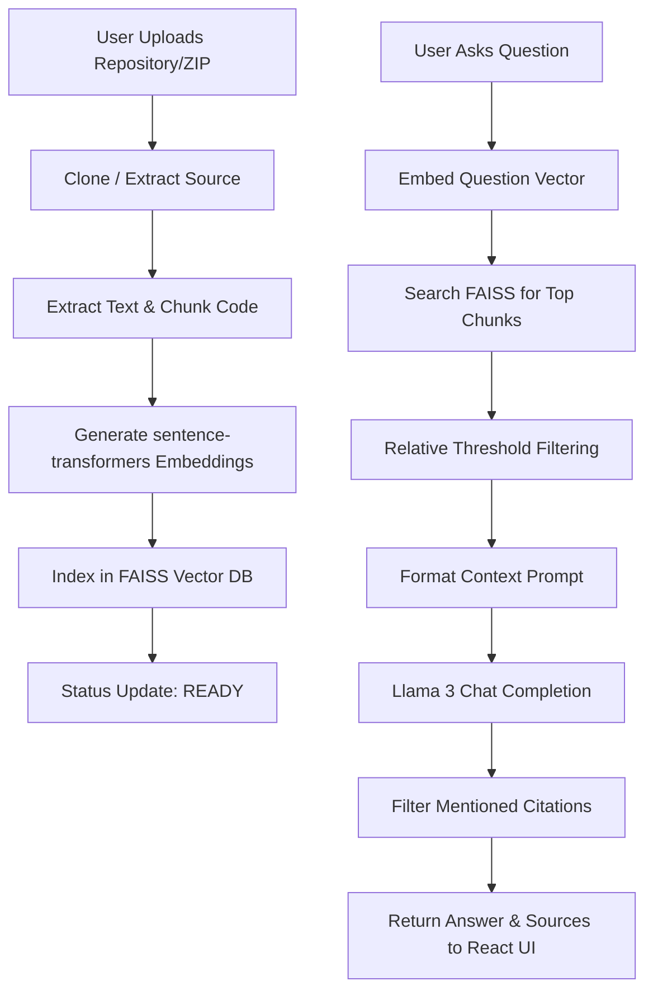

# 🧪 AI Legacy Code Knowledge Engine (NotebookLM for Codebases)

An advanced, premium-tier developer tool that brings a **NotebookLM-like Q&A experience** to any codebase. Developers, founders, and HR teams can upload a GitHub repository URL or a ZIP archive, and the engine automatically clones/extracts, parses, chunks, embeds, and indexes it into a local vector database. Users can then query the codebase conversationally and receive answers complete with precise source-file citations.

### 🔗 Live Deployments
* **Frontend Web App (Vercel)**: [https://ai-legacy-code-engine.vercel.app/](https://ai-legacy-code-engine.vercel.app/)
* **Backend API Server (Render)**: [https://ai-legacy-code-engine.onrender.com](https://ai-legacy-code-engine.onrender.com)

---

## 🚀 Key Features

* **Instant Repository Ingestion**: Paste a GitHub link or upload a `.zip` file. The backend clones/extracts and prepares the source code in seconds.
* **Intelligent Code Chunking & Embeddings**: Automatically parses files, generates 384-dimensional dense vectors using Hugging Face's `sentence-transformers/all-MiniLM-L6-v2`, and indexes them via a high-performance **FAISS Vector Database**.
* **Smart RAG (Retrieval-Augmented Generation)**: Uses dynamic relative similarity thresholds (`best_score * 0.82`) to filter out irrelevant tail chunks, ensuring the LLM (`meta-llama/Meta-Llama-3-8B-Instruct`) gets highly contextual information.
* **Precise Source-File Citations**: Prunes and lists citations to show only the exact files explicitly discussed/mentioned in the generated response, preventing noisy reference lists.
* **Conversational intelligence**: A custom-designed LLM prompt successfully separates chitchat/gratitude (*"hello"*, *"thank you for explaining"* etc.) from technical codebase queries, avoiding code hallucination during casual conversation.
* **Responsive Dark-Glassmorphism UI**: Fully responsive, interactive React dashboard optimized for both desktop and mobile layouts (featuring a slide-out overlay sidebar drawer and text-truncation wrapping), complete with workspace status polling, suggestions cards, clean list rendering, and smooth micro-animations.

---

## 🛠️ Tech Stack

### Backend
* **Python / FastAPI**: Asynchronous high-performance REST API.
* **FAISS (Facebook AI Similarity Search)**: Efficient similarity search on code embedding vectors.
* **huggingface_hub**: Offical Hugging Face InferenceClient API integration for embeddings and LLM completions.
* **Sentence Transformers**: `all-MiniLM-L6-v2` for semantic code search representation.

### Frontend
* **React / Vite**: Modern, ultra-fast frontend build tooling.
* **Tailwind CSS**: Custom dark-glassmorphism theme layout.
* **React Syntax Highlighter**: Prism-based styling for code blocks.
* **Axios**: Smooth asynchronous API requests.

---

## 📂 Architecture & Data Flow



---

## 🔧 Setup & Installation

### Backend Setup
1. Navigate to the backend directory:
   ```bash
   cd backend
   ```
2. Create and activate a Python virtual environment:
   ```bash
   python -m venv venv
   # On Windows
   .\venv\Scripts\activate
   # On macOS/Linux
   source venv/bin/activate
   ```
3. Install dependencies:
   ```bash
   pip install -r requirements.txt
   ```
4. Create a `.env` file in the `backend` folder and add your Hugging Face API Token:
   ```env
   HF_API_KEY=your_huggingface_api_token_here
   ```
5. Run the development server:
   ```bash
   uvicorn app.main:app --reload
   ```
   The backend API will run on `http://127.0.0.1:8000`.

### Frontend Setup
1. Navigate to the frontend directory:
   ```bash
   cd frontend
   ```
2. Install Node dependencies:
   ```bash
   npm install
   ```
3. Run the development server:
   ```bash
   npm run dev
   ```
   The frontend UI will run on `http://localhost:5173`.

---

## 🌐 Deployment Guidelines

### Backend (Render / Heroku)
* Set environment variables in the host dashboard:
  - `HF_API_KEY` = your Hugging Face token.
  - `PORT` = `8000` or dynamically assigned.
* Build Command: `pip install -r requirements.txt`
* Start Command: `uvicorn app.main:app --host 0.0.0.0 --port $PORT`

### Frontend (Vercel / Netlify)
* Build Command: `npm run build`
* Output Directory: `dist`
* Set up a rewrite rule in `vercel.json` if proxying API requests in production:
  ```json
  {
    "rewrites": [
      {
        "source": "/api/:path*",
        "destination": "https://your-backend-url.onrender.com/api/:path*"
      }
    ]
  }
  ```

---

## ⚙️ Enterprise-grade Enhancements Done
* **Safe Windows Directory Cleanup**: Fixed permission errors in deleting read-only git files (`pack`, `idx`) by adding a custom `chmod` permissions callback handler.
* **Auto-Recovery on Restart**: In-memory project states are dynamically restored from the disk database during startup.
* **Clean List UI Render**: Tailored custom regex markdown parser for React to support beautiful nested bullet points and numbered list items, styled with custom colored indigo bullet markers (`marker:text-indigo-400`).
* **Mobile Responsive Design**: Fluid, adaptive layouts built using Tailwind CSS breakpoints, collapsible absolute overlays for the sidebar, a backdrop blur overlay with touch-dismiss handlers, and CSS truncations for safe layout fits on narrow screens (iPhone/Android).
